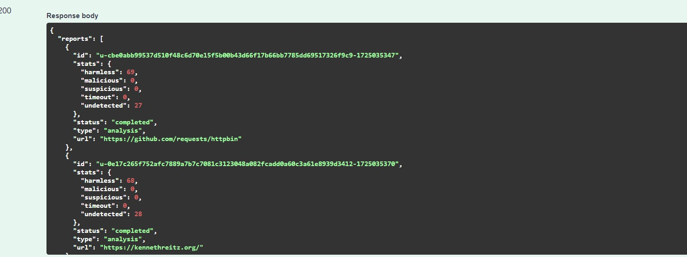

# Safe Link Application

The Safe Link Application takes a URL from the user, extracts all URLs from the content of that page, and uses the VirusTotal API to perform a security scan on each URL. The results are displayed to the user via a web interface.

## Features

- **URL Extraction:** Extracts all URLs from the provided webpage.
- **Security Scanning:** Performs a security scan on each extracted URL using the VirusTotal API.
- **Result Display:** Presents the scan results to the user in a web interface.
- **Docker Support:** The application is configured to run inside a Docker container.

## Installation

### Requirements

- Docker and Docker Compose must be installed.

### Steps

1. **Clone the Repository:**

   ```bash
   git clone https://github.com/alcmrt/SafeLinkApp.git
   cd SafeLinkApp
   ```

2. **Build and Run the Docker Container:**

   ```bash
   docker-compose up --build -d
   ```

3. **To See Logs From The Console:**

   ```bash
   docker-compose logs -f flask_app
   ```

4. **Open the Application in Your Browser:**

   The application will be running at `http://localhost:5000` by default.


5. **Swagger Interface**
    
    The application has Swagger interface integration. You can access the interface at `http://localhost:5000/swagger-ui`

## Usage

- **Home Page:** The user is prompted to enter a URL.
- **Scan Results:** All links from the URL are extracted, and a security scan is performed on each. The results are displayed in a list to the user.


- Here is an example for Scan Results: 



## Project Structure

- **run.py:** The entry point of the application.
- **app/**:
  - `__init__.py`: Contains the factory function that initializes the Flask application.
  - `controllers`: Defines the API endpoint for scanning URLs.
  - `services`: Handles interaction with the VirusTotal API and extracts URLs from the webpage.
  - `config`: Configures the application's logging.
  - `exceptions`: Contains custom SSL-related error handling.
  - `models`: Defines the API models.
- **requirements.txt:** Contains the Python dependencies.
- **Dockerfile:** Contains the instructions for building the Docker image.
- **docker-compose.yml:** Used to manage services with Docker.

## License

This project is licensed under the MIT License. See the `LICENSE` file for more information.
